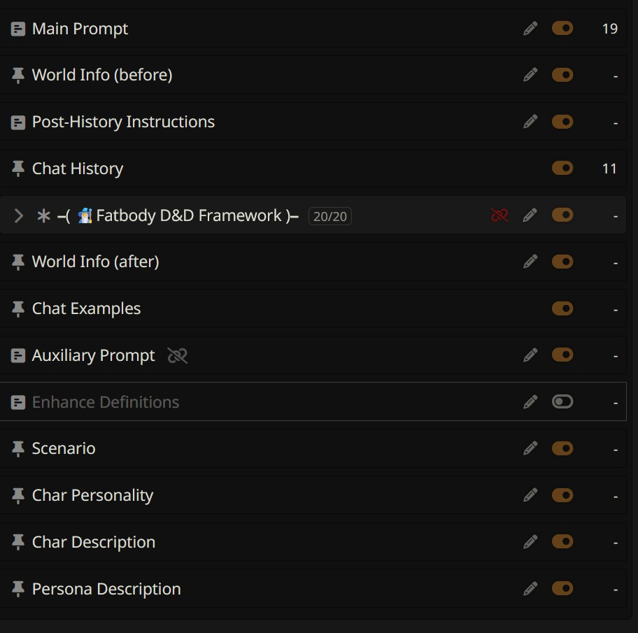
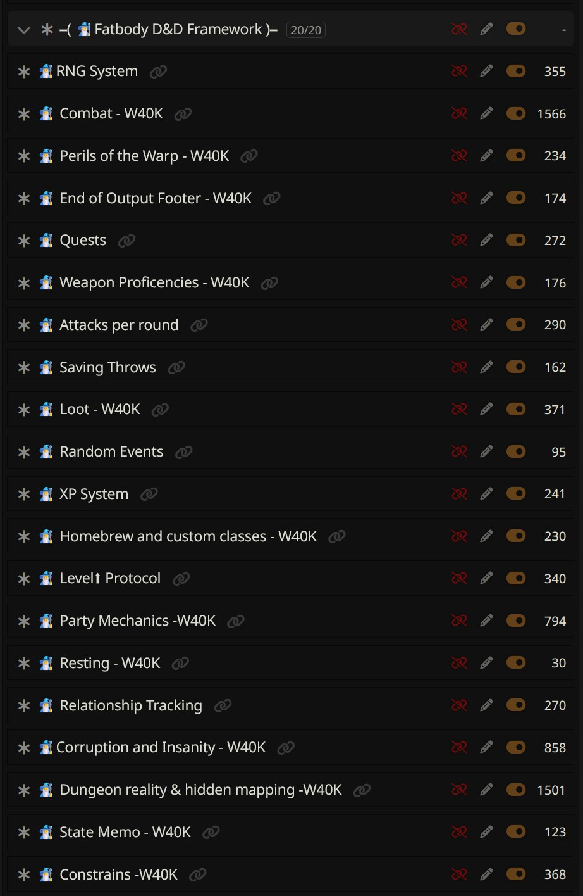
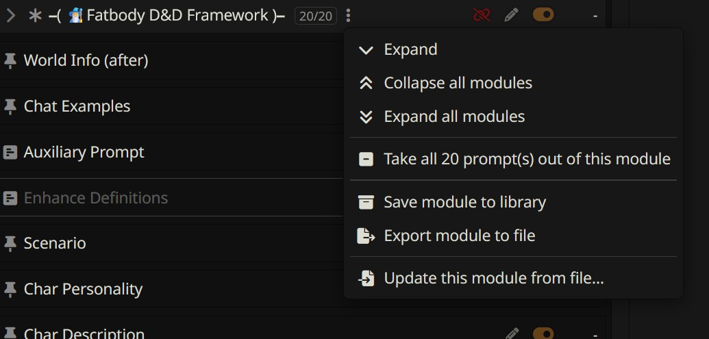
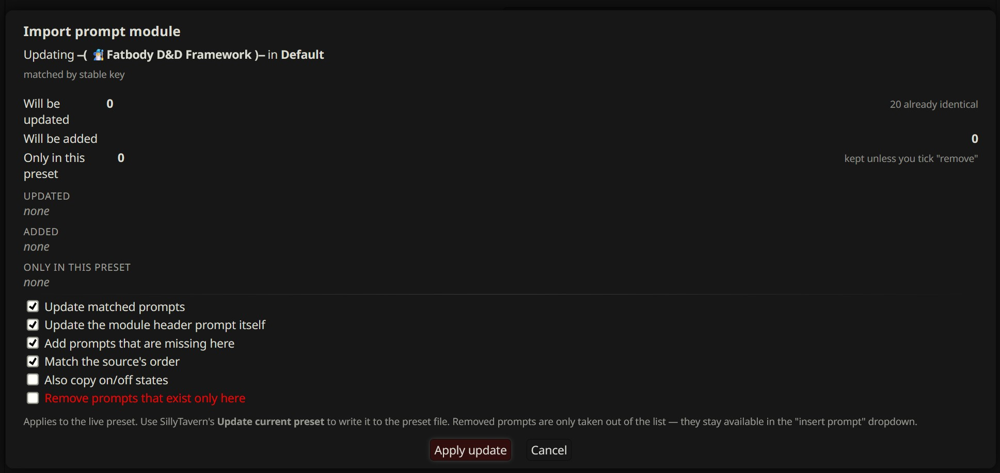
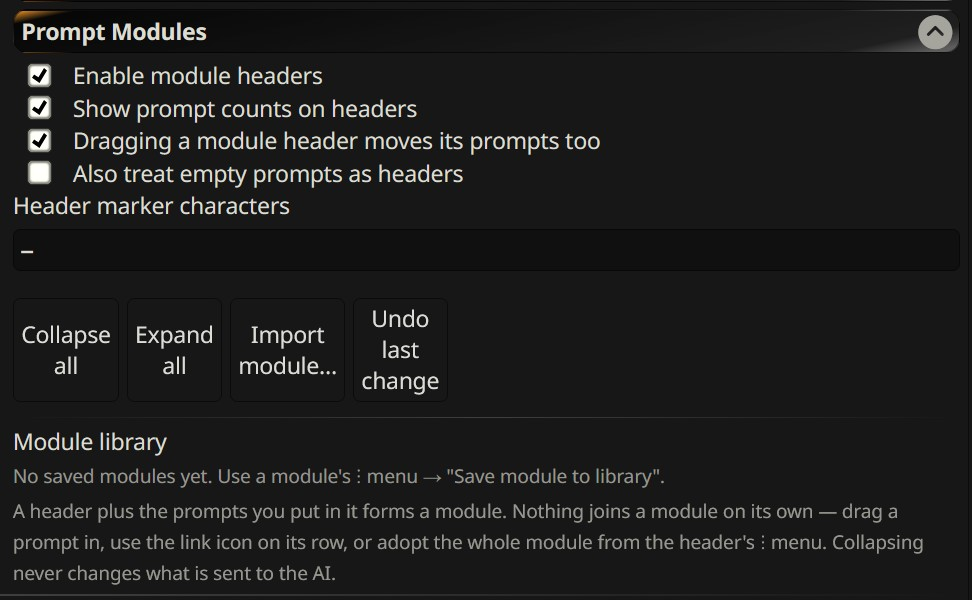

<div align="center">

# Prompt Modules

**Collapsible, reusable prompt modules for SillyTavern Chat Completion presets.**

Turn the section headers you already keep in your presets into real, collapsible,
shareable modules — without changing how SillyTavern builds prompts or what is
sent to the AI.

<sub>Built and verified against **SillyTavern 1.18.0**</sub>

</div>

---

## Tame the list

Any prompt whose name contains a marker character (default `━`) becomes a **module
header** — collapsible, with an `enabled/total` badge and a `⋮` menu.

<div align="center">
  
</div>

Twenty prompts, one row. Expand it and everything is back:

<div align="center">
  
</div>

- Collapse state is remembered **per preset**, and follows the preset if you rename it
- **Shift+click** a chevron to collapse or expand every module at once
- **Shift+click** a header's on/off switch to flip every prompt inside it
- **Dragging a header** carries its prompts with it — relocating a module is one drag
- Collapsing only hides rows. Nothing is disabled, reordered or detached, and
  `prompt_order` comes out byte-identical

## Membership is opt-in

A header opens a span, but sitting in that span doesn't put a prompt in the module.
Nothing joins on its own — prompts you want left alone simply stay that way.

| How | What it does |
|---|---|
| **Drag it in** | Drop it under the header or among the members and it joins. Drop it past the last member and it leaves. |
| **Row link icon** | Appears on hover. One click in or out, no dialog. |
| **Adopt from the `⋮` menu** | Takes in the whole run below the header — skipping SillyTavern's structural prompts (Chat History, World Info, anything `system_prompt`). |

A module is always a **contiguous unit**: its members are the unbroken run under the
header. Stored membership only counts while the prompt is still there, so the
metadata can never contradict what's on screen.

## Reuse modules across presets

<div align="center">
  
</div>

- **Save module to library** — a named copy that survives preset switches
- **Export module to file** — portable JSON
- **Update this module from file / library** — apply it to the preset you have open

Imports match on a stable key first, then the prompt's identifier, then the
normalised name (`━━━━━ Word Count` → `word count`), recording stable keys as they
go so later syncs survive renames.

### Nothing changes until you say so

<div align="center">
  
</div>

Every import opens a preview listing exactly what will be updated, added, and what
exists only in your preset. Defaults are non-destructive — removal is opt-in, and
even then prompts are only de-listed, staying available in the *insert prompt*
dropdown. Every apply can be reverted with **Undo last change**.

## Deleting a module

The red **Remove** chain on a header asks what you meant:

| | What happens |
|---|---|
| *(nothing ticked)* | Only the header leaves the list — exactly like SillyTavern's own Remove. Recoverable from the prompts dropdown. |
| **Remove the prompts too** | Header and members all leave the list. All still recoverable. |
| **Remove and delete the prompts too** | Erased. A snapshot is taken first, so **Undo** still brings them back. |

Prompts SillyTavern protects (system and marker prompts) are never removed or
deleted by any step. Removing a module clears the arrangement completely, so
re-adding the header later gives you a fresh, empty module.

## Settings

<div align="center">
  
</div>

Found under **Extensions → Prompt Modules**: toggle module headers, set the marker
character(s), show prompt counts, choose whether dragging a header moves its
prompts, optionally treat empty prompts as headers — plus the module library,
collapse/expand all, and undo.

## Install

**Extensions → Install extension**, then paste:

```
https://github.com/Cless-Aurion/Prompt-Modules
```

## Your presets stay yours

| Data | Where it lives |
|---|---|
| Module membership + sync links | `preset.extensions.promptModules` — an official SillyTavern field, ignored by stock ST |
| Collapse state, options, library | `extension_settings` — per-user UI state, so collapsing never dirties a preset |

Nothing is written to a preset until a prompt actually joins a module. **Remove this
extension and your presets stay completely valid** — no proprietary format, no
migration, no prompt objects modified to carry metadata.

## Licence

[AGPL-3.0-only](LICENSE), matching SillyTavern.
